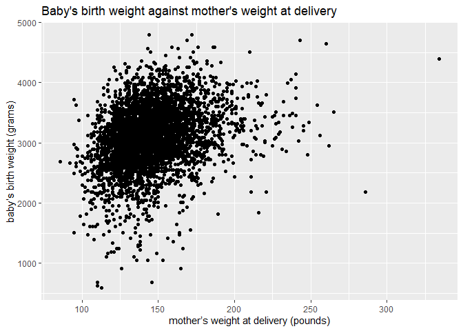
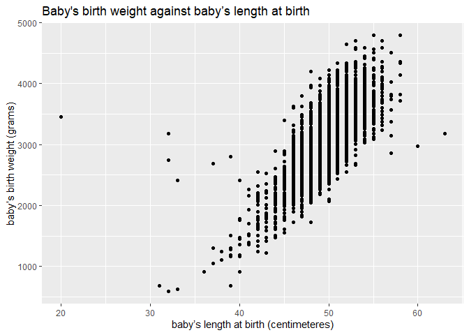
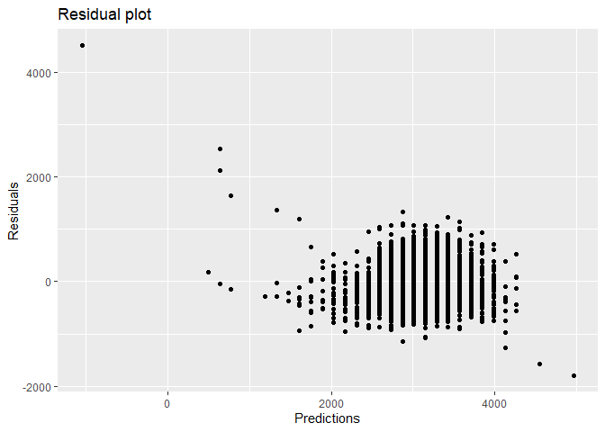
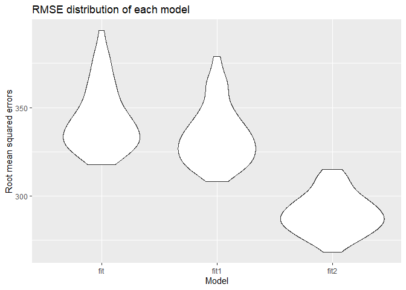
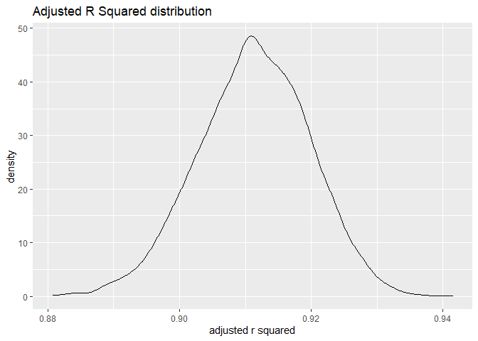
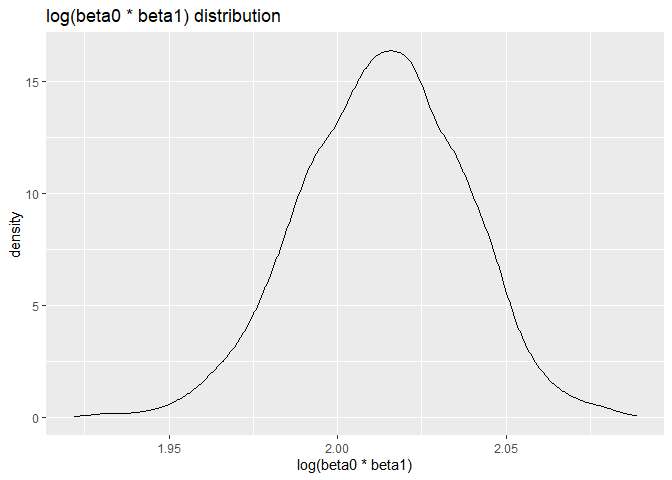

p8105\_hw6\_hz2770
================
Hao Zheng
11/30/2021

``` r
library(tidyverse)
```

    ## -- Attaching packages --------------------------------------- tidyverse 1.3.1 --

    ## v ggplot2 3.3.5     v purrr   0.3.4
    ## v tibble  3.1.4     v dplyr   1.0.7
    ## v tidyr   1.1.3     v stringr 1.4.0
    ## v readr   2.0.1     v forcats 0.5.1

    ## -- Conflicts ------------------------------------------ tidyverse_conflicts() --
    ## x dplyr::filter() masks stats::filter()
    ## x dplyr::lag()    masks stats::lag()

``` r
library(modelr)
library(mgcv)
```

    ## Loading required package: nlme

    ## 
    ## Attaching package: 'nlme'

    ## The following object is masked from 'package:dplyr':
    ## 
    ##     collapse

    ## This is mgcv 1.8-36. For overview type 'help("mgcv-package")'.

``` r
birthweight_data = read.csv("./data/birthweight.csv")
```

## Problem 1

First, clean the birthweight dataset.

``` r
birthweight_data = 
  birthweight_data %>% 
  mutate(
    babysex = as.factor(babysex),
    babysex = fct_recode(babysex, "male" = "1", "female" = "2"),
    
    frace = as.factor(frace),
    frace = fct_recode(frace, "White" = "1", "Black" = "2", "Asian" = "3", "Puerto Rican" = "4", "Other" = "8"),
    
    malform = as.logical(malform),
    
    mrace = as.factor(mrace),
    mrace = fct_recode(mrace, "White" = "1", "Black" = "2", "Asian" = "3", "Puerto Rican" = "4")
  )

birthweight_data %>% 
  skimr::skim()
```

|                                                  |            |
|:-------------------------------------------------|:-----------|
| Name                                             | Piped data |
| Number of rows                                   | 4342       |
| Number of columns                                | 20         |
| \_\_\_\_\_\_\_\_\_\_\_\_\_\_\_\_\_\_\_\_\_\_\_   |            |
| Column type frequency:                           |            |
| factor                                           | 3          |
| logical                                          | 1          |
| numeric                                          | 16         |
| \_\_\_\_\_\_\_\_\_\_\_\_\_\_\_\_\_\_\_\_\_\_\_\_ |            |
| Group variables                                  | None       |

Data summary

**Variable type: factor**

| skim\_variable | n\_missing | complete\_rate | ordered | n\_unique | top\_counts                             |
|:---------------|-----------:|---------------:|:--------|----------:|:----------------------------------------|
| babysex        |          0 |              1 | FALSE   |         2 | mal: 2230, fem: 2112                    |
| frace          |          0 |              1 | FALSE   |         5 | Whi: 2123, Bla: 1911, Pue: 248, Asi: 46 |
| mrace          |          0 |              1 | FALSE   |         4 | Whi: 2147, Bla: 1909, Pue: 243, Asi: 43 |

**Variable type: logical**

| skim\_variable | n\_missing | complete\_rate | mean | count              |
|:---------------|-----------:|---------------:|-----:|:-------------------|
| malform        |          0 |              1 |    0 | FAL: 4327, TRU: 15 |

**Variable type: numeric**

| skim\_variable | n\_missing | complete\_rate |    mean |     sd |     p0 |     p25 |     p50 |     p75 |   p100 | hist  |
|:---------------|-----------:|---------------:|--------:|-------:|-------:|--------:|--------:|--------:|-------:|:------|
| bhead          |          0 |              1 |   33.65 |   1.62 |  21.00 |   33.00 |   34.00 |   35.00 |   41.0 | ▁▁▆▇▁ |
| blength        |          0 |              1 |   49.75 |   2.72 |  20.00 |   48.00 |   50.00 |   51.00 |   63.0 | ▁▁▁▇▁ |
| bwt            |          0 |              1 | 3114.40 | 512.15 | 595.00 | 2807.00 | 3132.50 | 3459.00 | 4791.0 | ▁▁▇▇▁ |
| delwt          |          0 |              1 |  145.57 |  22.21 |  86.00 |  131.00 |  143.00 |  157.00 |  334.0 | ▅▇▁▁▁ |
| fincome        |          0 |              1 |   44.11 |  25.98 |   0.00 |   25.00 |   35.00 |   65.00 |   96.0 | ▃▇▅▂▃ |
| gaweeks        |          0 |              1 |   39.43 |   3.15 |  17.70 |   38.30 |   39.90 |   41.10 |   51.3 | ▁▁▂▇▁ |
| menarche       |          0 |              1 |   12.51 |   1.48 |   0.00 |   12.00 |   12.00 |   13.00 |   19.0 | ▁▁▂▇▁ |
| mheight        |          0 |              1 |   63.49 |   2.66 |  48.00 |   62.00 |   63.00 |   65.00 |   77.0 | ▁▁▇▂▁ |
| momage         |          0 |              1 |   20.30 |   3.88 |  12.00 |   18.00 |   20.00 |   22.00 |   44.0 | ▅▇▂▁▁ |
| parity         |          0 |              1 |    0.00 |   0.10 |   0.00 |    0.00 |    0.00 |    0.00 |    6.0 | ▇▁▁▁▁ |
| pnumlbw        |          0 |              1 |    0.00 |   0.00 |   0.00 |    0.00 |    0.00 |    0.00 |    0.0 | ▁▁▇▁▁ |
| pnumsga        |          0 |              1 |    0.00 |   0.00 |   0.00 |    0.00 |    0.00 |    0.00 |    0.0 | ▁▁▇▁▁ |
| ppbmi          |          0 |              1 |   21.57 |   3.18 |  13.07 |   19.53 |   21.03 |   22.91 |   46.1 | ▃▇▁▁▁ |
| ppwt           |          0 |              1 |  123.49 |  20.16 |  70.00 |  110.00 |  120.00 |  134.00 |  287.0 | ▅▇▁▁▁ |
| smoken         |          0 |              1 |    4.15 |   7.41 |   0.00 |    0.00 |    0.00 |    5.00 |   60.0 | ▇▁▁▁▁ |
| wtgain         |          0 |              1 |   22.08 |  10.94 | -46.00 |   15.00 |   22.00 |   28.00 |   89.0 | ▁▁▇▁▁ |

So there is no missing value in the dataset.

### Fit a model

Let’s hypothesize that birthweight is related to mother’s weight at
delivery `delwt`.

First, make a plot to see if there is a potential linear relationship
between `bwt` and `delwt`.

``` r
birthweight_data %>% 
  ggplot(aes(x = delwt, y = bwt)) +
  geom_point() +
  labs(
      title = "Baby's birth weight against mother's weight at delivery",
      x = "mother’s weight at delivery (pounds)",
      y = "baby’s birth weight (grams)"
    )
```

<!-- -->

However, as we can see from the above plot, there is no clear linear
relationship between `bwt` and `delwt`.

Emmm, maybe we should try explore the relationship between birthweight
and another variable. Let’s try baby’s length at birth `blength`.

``` r
birthweight_data %>% 
  ggplot(aes(x = blength , y = bwt)) +
  geom_point() +
  labs(
      title = "Baby's birth weight against baby’s length at birth",
      x = "baby’s length at birth (centimeteres)",
      y = "baby’s birth weight (grams)"
    )
```

<!-- -->

So there might be a linear relationship between birth weight and birth
length. Then fit a linear model with `bwt` as outcome, `blength` as the
predictor.

``` r
fit = lm(bwt ~ blength, data = birthweight_data)

fit %>% 
  broom::tidy() %>% 
  knitr::kable(digits = 3)
```

| term        |  estimate | std.error | statistic | p.value |
|:------------|----------:|----------:|----------:|--------:|
| (Intercept) | -3841.267 |    95.122 |   -40.382 |       0 |
| blength     |   139.811 |     1.909 |    73.233 |       0 |

Since the p value is very small(around zero), so we can establish a
linear relationship between these two variables.

Now plot the residual plots

``` r
birthweight_data %>% 
  add_residuals(fit) %>% 
  add_predictions(fit) %>%  
  ggplot(aes(x = pred, y = resid)) +
  geom_point() +
  labs(
      title = "Residual plot",
      x = "Predictions",
      y = "Residuals"
    )
```

<!-- -->

From the plot of predicted values against residuals, we can see most of
the residuals are near 0, but there are also some extremely normal
values when prediction is under 1000.

### Compare with two other models

``` r
# use length at birth and gestational age as predictors
fit1 = lm(bwt ~ blength + gaweeks, data = birthweight_data)

fit1 %>% 
  broom::tidy() %>% 
  knitr::kable(digits = 3)
```

| term        |  estimate | std.error | statistic | p.value |
|:------------|----------:|----------:|----------:|--------:|
| (Intercept) | -4347.667 |    97.958 |   -44.383 |       0 |
| blength     |   128.556 |     1.990 |    64.604 |       0 |
| gaweeks     |    27.047 |     1.718 |    15.744 |       0 |

``` r
# use head circumference, length, sex, and all interactions (including the three-way interaction) between these
fit2 = lm(bwt ~ bhead + blength + babysex + bhead*blength + bhead*babysex + blength*babysex + bhead*blength*babysex, data = birthweight_data)

fit2 %>% 
  broom::tidy() %>% 
  knitr::kable(digits = 3)
```

| term                        |  estimate | std.error | statistic | p.value |
|:----------------------------|----------:|----------:|----------:|--------:|
| (Intercept)                 | -7176.817 |  1264.840 |    -5.674 |   0.000 |
| bhead                       |   181.796 |    38.054 |     4.777 |   0.000 |
| blength                     |   102.127 |    26.212 |     3.896 |   0.000 |
| babysexfemale               |  6374.868 |  1677.767 |     3.800 |   0.000 |
| bhead:blength               |    -0.554 |     0.780 |    -0.710 |   0.478 |
| bhead:babysexfemale         |  -198.393 |    51.092 |    -3.883 |   0.000 |
| blength:babysexfemale       |  -123.773 |    35.119 |    -3.524 |   0.000 |
| bhead:blength:babysexfemale |     3.878 |     1.057 |     3.670 |   0.000 |

According to the results, the fit1 model is quite significant, but the
fit2 model has a big p value for the term: interaction between `bhead`
and `blength`.

### Cross-validation

``` r
cv_df = 
  crossv_mc(birthweight_data, 100) %>% 
  mutate(
    fit_mod = map(train, ~lm(bwt ~ blength, data = .x)),
    fit1_mod = map(train, ~lm(bwt ~ blength + gaweeks, data = .x)),
    fit2_mod = map(train, ~lm(bwt ~ bhead + blength + babysex + bhead*blength + bhead*babysex + blength*babysex + bhead*blength*babysex, data = .x))
    ) %>% 
  mutate(
    rmse_fit = map2_dbl(fit_mod, test, ~rmse(model = .x, data = .y)),
    rmse_fit1 = map2_dbl(fit1_mod, test, ~rmse(model = .x, data = .y)),
    rmse_fit2 = map2_dbl(fit2_mod, test, ~rmse(model = .x, data = .y))
  )
```

### RMSE model

``` r
cv_df %>% 
  select(starts_with("rmse")) %>% 
  pivot_longer(
    everything(),
    names_to = "model", 
    values_to = "rmse",
    names_prefix = "rmse_") %>% 
  mutate(model = fct_inorder(model)) %>% 
  ggplot(aes(x = model, y = rmse)) + 
  geom_violin() +
  labs(
      title = "RMSE distribution of each model",
      x = "Model",
      y = "Root mean squared errors"
    )
```

<!-- -->

Based on the RMSE distribution plot, we know that the fit2 model has the
lowest RMSE, and the fit model has the highest RMSE, which means the
fit2 model may be the most optimal among these three models.

## Problem 2

Now let’s turn to the 2017 Central Park weather data. First, download
the data.

``` r
weather_df = 
  rnoaa::meteo_pull_monitors(
    c("USW00094728"),
    var = c("PRCP", "TMIN", "TMAX"), 
    date_min = "2017-01-01",
    date_max = "2017-12-31") %>%
  mutate(
    name = recode(id, USW00094728 = "CentralPark_NY"),
    tmin = tmin / 10,
    tmax = tmax / 10) %>%
  select(name, id, everything())
```

    ## Registered S3 method overwritten by 'hoardr':
    ##   method           from
    ##   print.cache_info httr

    ## using cached file: C:\Users\hao\AppData\Local/Cache/R/noaa_ghcnd/USW00094728.dly

    ## date created (size, mb): 2021-09-23 09:21:18 (7.614)

    ## file min/max dates: 1869-01-01 / 2021-09-30

### Bootstrapping

``` r
boot_sample = function(df){
  sample_frac(df, size = 1, replace = TRUE)
}

boot_straps = 
  data_frame(
    strap_number = 1:5000,
    strap_sample = rerun(5000, boot_sample(weather_df))
  )
```

    ## Warning: `data_frame()` was deprecated in tibble 1.1.0.
    ## Please use `tibble()` instead.
    ## This warning is displayed once every 8 hours.
    ## Call `lifecycle::last_warnings()` to see where this warning was generated.

### Adjusted R\_squared

``` r
adj_r_squared = 
  boot_straps %>% 
  mutate(
    models = map(strap_sample, ~lm(tmax ~ tmin, data = .x)),
    results = map(models, broom::glance)
  ) %>% 
  select(strap_number, results) %>%
  unnest(results) %>%
  select(strap_number, adj.r.squared)

# make the distribution plot
adj_r_squared %>%
  ggplot(aes(x = adj.r.squared)) +
  geom_density() +
  labs(
    x = "adjusted r squared",
    title = "Adjusted R Squared distribution"
  )
```

<!-- -->

``` r
# 95% CI
adj_r_squared_CI = 
  adj_r_squared %>% 
  summarise(
    ci_lower = quantile(adj.r.squared, 0.025), 
    ci_upper = quantile(adj.r.squared, 0.975)
  )

adj_r_squared_CI
```

    ## # A tibble: 1 x 2
    ##   ci_lower ci_upper
    ##      <dbl>    <dbl>
    ## 1    0.894    0.927

The adjusted r squared follows an approximately normal distribution,
unimodel, symmetric, with a little longer left tail and mean around
0.91. And the 95% confidence interval for the adjusted r squared value
is `[0.894, 0.927]`.

### log(beta0 \* beta1)

``` r
log_beta = 
  boot_straps %>% 
  mutate(
    models = map(strap_sample, ~ lm(tmax ~ tmin, data = .x)),
    results = map(models, broom::tidy)
  ) %>% 
  select(strap_number, results) %>%
  unnest(results) %>%
  select(strap_number, term, estimate) %>% 
  pivot_wider(
    names_from = term,
    values_from = estimate
  ) %>% 
  janitor::clean_names() %>% 
  mutate(
    log_value = log(intercept * tmin) 
  )

# make the distribution plot
log_beta %>% 
  ggplot(aes(x = log_value)) +
  geom_density() +
  labs(
    x = "log(beta0 * beta1)",
    title = "log(beta0 * beta1) distribution"
  )
```

<!-- -->

``` r
# 95% CI
log_beta_CI = 
  log_beta %>% 
  summarise(
    ci_lower = quantile(log_value, 0.025), 
    ci_upper = quantile(log_value, 0.975)
  )

log_beta_CI
```

    ## # A tibble: 1 x 2
    ##   ci_lower ci_upper
    ##      <dbl>    <dbl>
    ## 1     1.97     2.06

The distribution is also approximately normal, unimodel, quite
symmetric, with a mean around 2.02. The 95% confidence interval for
`log(beta0 * beta1)` is `[1.96, 2.06]`.
